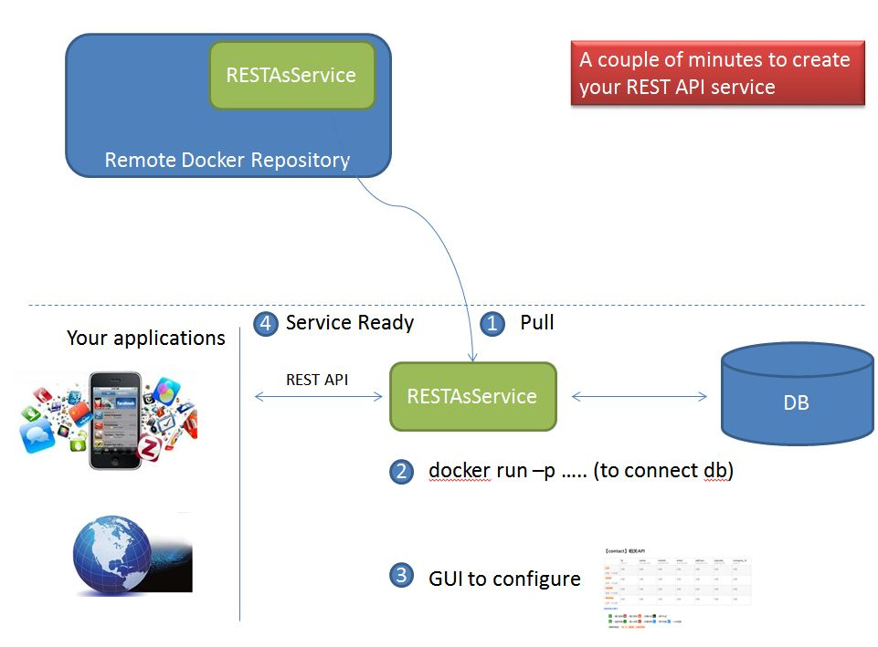

RestAsService
=============

This project is to create REST API easily just by click some button on the GUI.

This project can be running as the docker image. You pull it and run it, then you will get the REST API interface for your database.

